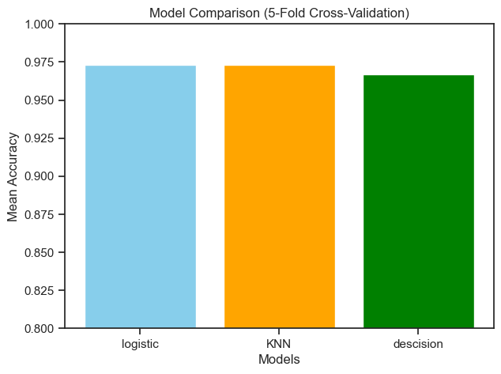
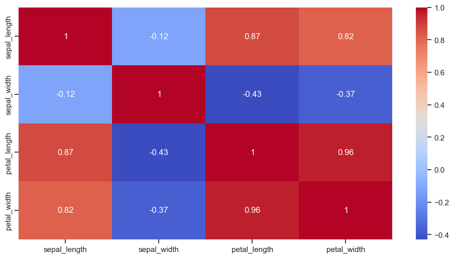

# 🌸 Iris Flower Classification 🌿

A beginner-friendly **Machine Learning** project that predicts the species of an Iris flower using **sepal** and **petal** measurements. I experimented with multiple ML models, compared their accuracies using **cross-validation**, and visualized the results.

---

## 📌 Overview

The **Iris dataset** is one of the most popular beginner datasets in machine learning.

In this project, I:
- Explored the dataset 📊
- Visualized relationships between features 🌿
- Trained multiple ML models 🧠
- Compared their accuracies using **5-fold cross-validation**
- Selected the **best model** for predictions ✅

---

## 📂 Dataset

- **Source**: Built-in dataset from `sklearn.datasets`
- **Features**:
  - Sepal length (cm)
  - Sepal width (cm)
  - Petal length (cm)
  - Petal width (cm)
- **Target Classes**:
  - Setosa 🌺
  - Versicolor 🌸
  - Virginica 🌿

---

## 🧠 Models Used

I tested multiple supervised ML models:

| Model                | Mean Accuracy (5-Fold CV) |
|----------------------|--------------------------|
| Logistic Regression  | **97.3%**                |
| K-Nearest Neighbors  | 96.7%                    |
| Decision Tree        | 95.3%                    |

---

## 📊 Visualizations

### 🔹 Pairplot of Features


### 🔹 5-Fold Cross-Validation Accuracy


### 🔹 Feature Correlation Heatmap


---

## 🚀 How to Run the Project

### 1️⃣ Clone the Repository

```bash
git clone https://github.com/poudelaman4/Iris-Flower-Classification.git
cd Iris-Flower-Classification
```

### 2️⃣ Install Dependencies

```bash
pip install -r requirements.txt
```

### 3️⃣ Run the Notebook

Open Jupyter Notebook:

```bash
jupyter notebook Iris_Classification.ipynb
```

---

## 🛠️ Tech Stack

- **Language:** Python 🐍
- **Libraries:** Pandas, NumPy, Seaborn, Matplotlib, Scikit-learn
- **IDE/Notebook:** Jupyter Notebook

--
## 🧑‍💻 Author

**Aman Paudel**

🔗 [GitHub Profile](https://github.com/poudelaman4)